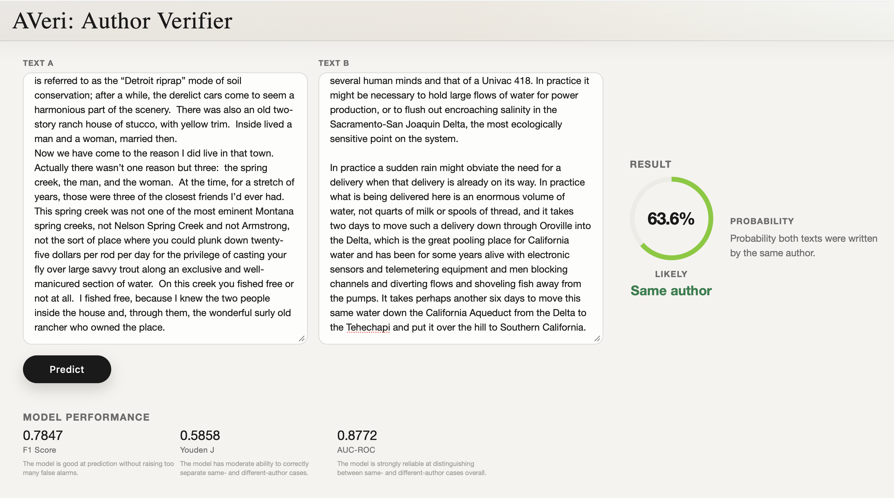
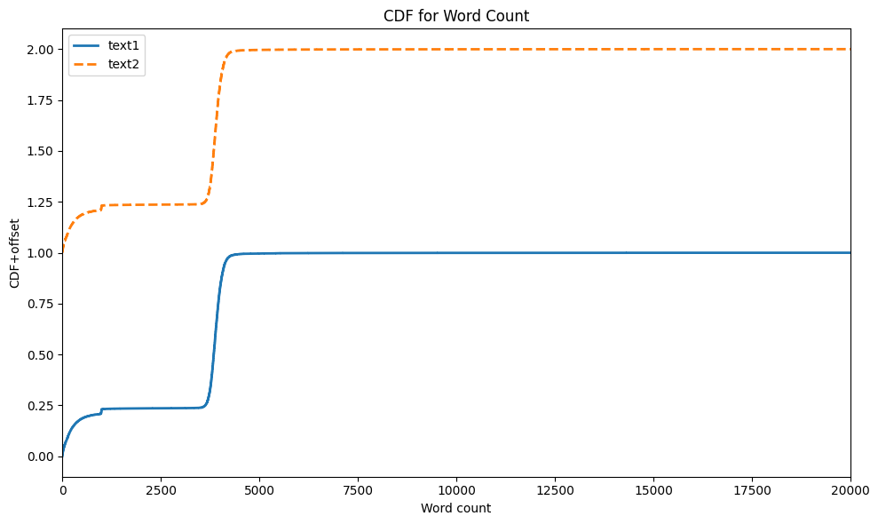

# AVeri: Author Verification

This repository contains the source code for an *authorship verifier* tool, which is used to predict whether a given pair of two texts were written by the same author based purely on stylistic and lexical characteristics (not semantic which is used to convey meaning or topic). The repository includes end-to-end machine learning pipeline for preparing paired texts, extracting stylometric and lexical features, training a binary classifier, and serving the trained model through a small Flask web app.

🎥 [YOU CAN ACCESS THE LIVE DEMO HERE](https://averi-rec.vercel.app/) 🎥



⚠️ **IMPORTANT!** ⚠️  

- The tool is only trained on English text. Other languages are not yet supported.
- The tool is **NOT** perfect. Although the in-app-shown metrics show that the model might perform reasonably well, in many cases, it will still predict false positives or negatives. This is because the model has a very important underlying assumption: different authors would have different writing styles. Since it is trained by considering the stylistic and lexical features only, if two texts look similar based on those features, it will still predict them as coming from the same author although they were actually written by different authors. This is especially true for many formal or proper texts, where there are minimum stylistic differences between authors, making distinguishing the two classes noticeably more difficult. Hence, please interpret the result accordingly.
- The current saved model uses a classification threshold of 0.58, selected by maximizing Youden's J statistic on the validation set.

## Tools Used

### Backend

- pandas
- numpy
- sklearn
- scipy
- spaCy
- XGBoost
- Flask

### Frontend

- HTML
- CSS
- JavaScript (plain)


## How to Run

### Minimal Procedure

Run the following commands:

```bash
python -m venv .venv
source .venv/bin/activate
pip install -r requirements.txt
python -m spacy download en_core_web_lg
```

`en_core_web_lg` is the spaCy model used to process the texts before training. See [https://spacy.io/models/en#en_core_web_lg](https://spacy.io/models/en#en_core_web_lg). In principle, one can use any spaCy model desired, including `en_core_web_trf`, which is the best model available (using transformer). Just make sure there is enough device RAM for the processing as it may consume a huge amount of memory if there are many long texts.

If all saved model artifacts are present in the repo (which they should be; but if not, see [here](#4.-rebuild-the-training-pipeline)), directly run:

```bash
python app.py
```

Then open:

```text
http://127.0.0.1:5000
```

### Run a Prediction From Python

From the project root:

```bash
PYTHONPATH=src python
```

Then:

```python
from inference import Inference

service = Inference(project_root=".")
result = service.predict("First text here.", "Second text here.")
print(result.to_dict())
```

### Rebuild the Training Pipeline

The full pipeline (except model training and inference) is run in [src/pipeline.ipynb](src/pipeline.ipynb) so any interesting user can just follow the steps in the notebook until features extraction.

The datatest can be downloaded from [HERE](https://huggingface.co/swan07/bert-authorship-verification), which already includes all three splits: train, validation, and test. The expected downloaded data location is:

```text
data/raw/
|-- authorship_verification_train/
|-- authorship_verification_validation/
`-- authorship_verification_test/
```

The notebook performs the pipeline stages in order and writes artifacts under [saved/](saved/). I make `data/raw/`, `*.parquet`, and `*.pkl` to be ignored by Git, so these generated artifacts must be recreated locally after cloning before you can train the model. Specifically, [src/model_training.py](src/model_training.py), the training pipeline, expects:

```text
saved/ngram_features/dataframes/train_ngram.parquet
saved/ngram_features/dataframes/validation_ngram.parquet
saved/ngram_features/dataframes/test_ngram.parquet
```

Model training can then be launched directly after the feature parquet files exist with:

```bash
python src/model_training.py
```

## Contents

```text
.
|-- app.py
|-- README.md
|-- .gitignore
|-- src/
|   |-- audit.py
|   |-- normalization.py
|   |-- masking_regex.py
|   |-- masking_spacy.py
|   |-- features_statistical.py
|   |-- features_tfidf.py
|   |-- features_ngram.py
|   |-- dimensionality_reduction.py
|   |-- model_training.py
|   |-- inference.py
|   |-- helpers.py
|   |-- function_words.py
|   `-- pipeline.ipynb
|-- saved/
|   |-- audit/
|   |-- normalization/
|   |-- masking/
|   |-- statistical_features/
|   |-- tfidf_features/
|   |-- ngram_features/
|   |-- dimensionality_reduction/
|   |-- pairwise_baseline/
|   `-- model/
|-- static/
|   |-- app.js
|   `-- styles.css
`-- templates/
    `-- index.html
```


## Pipeline Overview

### 1. Audit and Filtering

Implemented in [src/audit.py](src/audit.py).

The audit stage loads the HuggingFace datasets (download from [HERE](https://huggingface.co/swan07/bert-authorship-verification)) from disk for `train`, `validation`, and `test`. Importantly, tt removes rows where (among other filterings) either text is outside the configured word-count range.



### 2. Normalization

Implemented in [src/normalization.py](src/normalization.py).

The normalization stage reduces accidental text variation before feature extraction:

- HTML entities are unescaped.
- Broken Unicode is repaired with `ftfy`.
- Unicode is normalized with NFC.
- Line endings are standardized to `\n`.
- Non-printable control characters are removed.
- Curly quotes, long dashes, minus signs, and non-breaking spaces are mapped to simpler equivalents.
- Inline whitespace is collapsed.
- Excess newlines are limited.
- LaTeX math spans are normalized.

### 3. Regex Masking

Implemented in [src/masking_regex.py](src/masking_regex.py).

This stage replaces surface identifiers with placeholders:

| Pattern | Placeholder |
|---|---|
| URL | `<URL>` |
| Email | `<EMAIL>` |
| Date | `<DATE>` |
| Time | `<TIME>` |
| Currency | `<CURRENCY>` |
| Address | `<ADDRESS>` |
| Organization suffix | `<ORG_SUFFIX>` |
| Number | `<NUMBER>` |

It is done to reduce topic, identity, and context leakage; the model should learn purely on the writing style, not the content. For example, two texts mentioning the same person, date, company, or URL should not be judged same-author just because they share named content.

### 4. spaCy Masking and Linguistic Cache

Implemented in [src/masking_spacy.py](src/masking_spacy.py).

After regex masking, spaCy parses each text. The pipeline masks named entities using labels and replace them with some defined placeholders. At the same time, the pipeline saves a linguistic cache for each text which is used for feature extraction.

For my current device specifications, I am not able to process many texts with word-count more than 3500 as the memory requirement for spaCy parsing/masking far exceeds my available RAM (64GB). This is quite a shame since the word-count distribution has two peaks, lower peak at less than 1500 and higher peak at around 4000 words (see below). So I am losing lots of potential signals. If an interested user can come up with some ways to process all available texts, kindly share the results to me as I would be definitely interested :)

## Feature Engineering

The project extracts feature vectors independently for `text1` and `text2`, then compares the two vectors during model training. The features can be grouped into five categories:

1. Statistical features,
2. Lemma TF-IDF features,
3. Character n-gram features,
4. POS n-gram features,
5. Readability

### Statistical and Stylometric Features

Implemented in [src/features_statistical.py](src/features_statistical.py).

These features represent writing style and include:

- average sentence length in words
- average function words per sentence
- function-word rate (this is given in [src/function_words.py](src/function_words.py))
- punctuation rate
- average word length
- noun phrase, prepositional phrase, and clausal phrase rates
- POS tag distribution
- dependency-label distribution

### Lemma TF-IDF Features

Implemented in [src/features_tfidf.py](src/features_tfidf.py).

This stage builds a content-word corpus from spaCy lemmas (includes 25,000 such features and can be tuned in the file's config). Tokens are excluded if they are:

- punctuation or whitespace
- masking placeholders
- too short
- non-alphabetic
- outside the allowed POS tags
- function words
- English stop words

TF-IDF gives higher weight to terms that are frequent in one document but not common across all documents. Conceptually:

$$
\begin{aligned}
\mathrm{TFIDF}(t, d) &= \mathrm{tf}(t, d) \cdot \mathrm{IDF}(t), \\
\mathrm{IDF}(t) &= \log\left(\frac{1 + N}{1 + \mathrm{df}(t)}\right) + 1
\end{aligned}
$$

With sublinear term frequency:

$$
\mathrm{TF}(t, d) = 1 + \log(\mathrm{raw\_count}(t, d))
$$

The vectorizer is fit only on the training split, then reused for validation, test, and inference.

### Character N-Gram Features

Implemented in [src/features_ngram.py](src/features_ngram.py).

This follows the method used in [Koppel & Winter (2013)](https://asistdl.onlinelibrary.wiley.com/doi/10.1002/asi.22954). The pipeline builds space-free character 4-grams within each token. For example, a token such as:

```text
writing
```

will have 4-grams that are:

```text
writ, riti, itin, ting
```

These n-grams are also represented with TF-IDF. In the current pipeline, the maximum number of vocabularies for the 4-gram features is set to be 50,000.

### POS N-Gram Features

Implemented in [src/features_ngram.py]([src/features_ngram.py).

The pipeline converts each text into a sequence of POS tags, excluding punctuation and whitespace, then extracts POS n-grams. The current pipeline uses POS 2-grams and 3-grams with vocab that is maxed out to 5,000 features.

### Readability Features

Implemented in [src/features_ngram.py]([src/features_ngram.py).

The pipeline computes:

- Flesch-Kincaid grade
- Gunning fog index
- SMOG index
- Coleman-Liau index

These formulas estimate reading difficulty from quantities such as sentence length, word length, syllable counts, and character counts. The current pipeline uses self-defined formulas but one can also see [here](https://github.com/textstat/textstat/tree/main).

## Dimensionality Reduction

Implemented in [src/dimensionality_reduction.py](src/dimensionality_reduction.py).

The repository includes a TruncatedSVD stage for reducing high-dimensional TF-IDF, character n-gram, and POS n-gram feature families. TruncatedSVD approximates a matrix factorization:

$$
X \approx U_k \Sigma_k V_k^\top
$$

where `k` is the number of retained latent components. This can reduce feature dimensionality while preserving major variance directions.

This step is currently ignored in the pipeline although it can be included anytime. The SVD code and saved summaries are present as an optional or experimental stage.

A dimensionality reduction might be needed if one feels that there are too many features included for training. For example, the current pipeline has roughly 80,000 features (mostly coming from the n-gram features) and hence reducing them to only a handful of features while keeping most of the variance intact might be desired. However, please be aware that if dimensionality reduction is performed, converting to sparse matrix format in the model training (see next section) may be useless because the reduction process will populate the features table almost fully with potentially more cells filled than without dimensionality reduction. Without dimensionality reduction, the features table is a sparse matrix by construction since most texts do not have most features, so converting to sparse matrix format would be useful.

## Model Training

Implemented in [src/model_training.py](src/model_training.py).

### Pairwise Feature Construction

For each original feature suffix `j`, the pipeline has:

$$
\begin{aligned}
x_{1,j} &= \text{feature } j \text{ for text1}, \\
x_{2,j} &= \text{feature } j \text{ for text2}
\end{aligned}
$$

It builds local pairwise features:

$$
\begin{aligned}
\mathrm{abs diff}_j &= \left|x_{1,j} - x_{2,j}\right|, \\
\mathrm{product}_j &= x_{1,j} \cdot x_{2,j}
\end{aligned}
$$

The absolute difference measures distance for a single feature whereas the product measures whether both texts have similarly high values for that feature. The pipeline also builds global pairwise features for feature families such as TF-IDF, character n-grams, POS n-grams, and scalar style features following:

$$
\begin{aligned}
\mathrm{cosine similarity}(x_1, x_2) &= \frac{x_1 \cdot x_2}{\lVert x_1 \rVert \lVert x_2 \rVert}, \\
L^1(x_1, x_2) &= \sum_j \left|x_{1,j} - x_{2,j}\right|, \\
L^2(x_1, x_2) &= \sqrt{\sum_j \left(x_{1,j} - x_{2,j}\right)^2}
\end{aligned}
$$

### Classifier

The final classifier uses `xgboost.XGBClassifier` with binary logistic objective. The model outputs:

$$
P(\text{same author} \mid \text{pair\_ features})
$$

### Threshold Selection

The model first produces probabilities which is turned into labels via:

$$
\text{predicted label} =
\begin{cases}
1, & \text{if } p \geq \tau, \\
0, & \text{otherwise}
\end{cases}
$$

The threshold is selected on the validation split by grid search. The configured metric is Youden's J (but it can be changed from the file's config):

$$
\begin{aligned}
\text{sensitivity} &= \frac{TP}{TP + FN}, \\
\text{specificity} &= \frac{TN}{TN + FP}, \\
J &= \text{sensitivity} + \text{specificity} - 1
\end{aligned}
$$

The current threshold used for the web app is:

```text
0.58
```

### Current Performance Metrics

| Split | Accuracy | Precision | Recall | F1 | Balanced Accuracy | Specificity | Youden J | ROC-AUC |
|---|---:|---:|---:|---:|---:|---:|---:|---:|
| Validation | 0.78197 | 0.84440 | 0.73342 | 0.78500 | 0.78651 | 0.83960 | 0.57302 | 0.87306 |
| Test | 0.79001 | 0.84661 | 0.73118 | 0.78467 | 0.79288 | 0.85459 | 0.58576 | 0.87719 |

These can be seen in [saved/model/metrics.json](saved/model/metrics.json).

## Inference

Runtime inference is implemented in `src/inference.py`.

For a new pair of texts, inference repeats the training-time transformations:

1. Normalize both texts.
2. Apply regex masking.
3. Apply spaCy NER masking.
4. Build a one-row linguistic cache.
5. Extract statistical features.
6. Transform lemma TF-IDF with the saved vectorizer.
7. Transform character n-grams with the saved vectorizer.
8. Transform POS n-grams with the saved vectorizer.
9. Compute readability features.
10. Build local and global pairwise features.
11. Load the saved XGBoost model.
12. Return probability and label using the saved threshold.

## Primary Sources

- Koppel, M. & Winter, Y. "Determining if two documents are written by the same author." Journal of the Association for Information Science and Technology, 2014. [https://doi.org/10.1002/asi.22954](https://doi.org/10.1002/asi.22954).
- Zhang, Y. "An ensemble deep learning model for author identification through multiple features." Nature Science Reports, 2025. [https://doi.org/10.1038/s41598-025-11596-5](https://doi.org/10.1038/s41598-025-11596-5).
- Sadei, C. & Dras, M. "Siamese networks for large-scale author identification." Springer Computer Speech & Language, 2021. [https://doi.org/10.1016/j.csl.2021.101241](https://doi.org/10.1016/j.csl.2021.101241)
- swan07. “bert-authorship-verification.” Hugging Face Datasets. [https://huggingface.co/swan07/bert-authorship-verification](https://huggingface.co/swan07/bert-authorship-verification)

## Author's Remarks

This is a personal project intended to be a portfolio. I am not currently planning to push into production except if there are some interested collaborators, in which case, please feel free to contact me at salirafi8@gmail.com :)

The use of generative AI includes: Github Copilot to help in code syntax and identifying bugs and errors. Outside of those, including problem formulation and framework of thinking, code logical reasoning and writing, from database management to web development, all is done mostly by the author.
